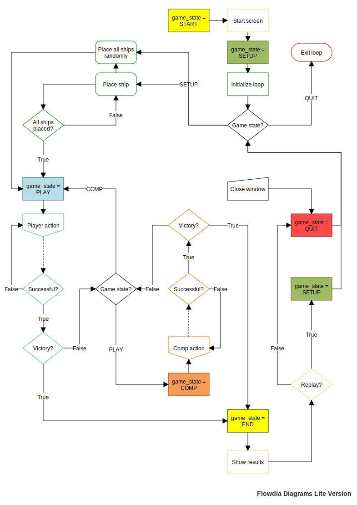
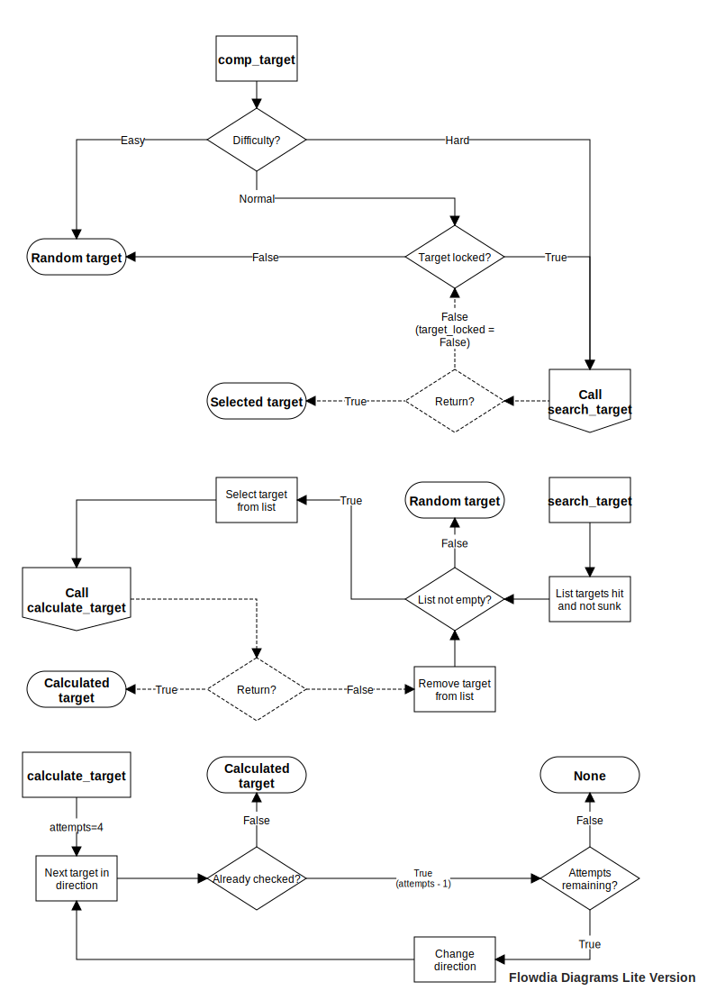

I'm new to python and GitHub.
This is the second iteration of my battleship project.
I've been working on this as a way to learn more python and how to use pygame.

## Main Game Flow

## AI Targeting Flow

